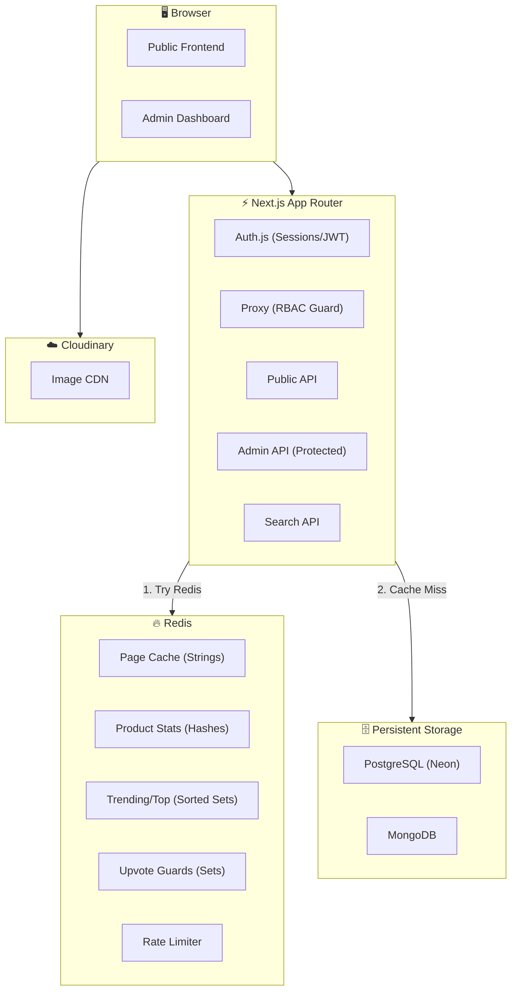

# ProductReview.com.au Clone — Enterprise Architecture Document

> A massive, production-grade product review platform. This architecture covers RBAC, Review Moderation, Full-Text Search, Brand Responses, SEO/JSON-LD, User Profiles, and advanced Redis data structures.

---

## 1. Feature Specifications

### Core Platform
*   **Role-Based Access Control (RBAC):** `ADMIN` and `USER` roles.
    *   **Users:** Browse, search, submit reviews (with images), upvote/downvote, flag reviews, view profiles.
    *   **Admins:** Full CRUD on Products/Brands/Categories, moderate reviews, respond as brand, manage users.
*   **Review Moderation Queue:** User reviews start as `PENDING`. They only appear publicly and affect ratings after Admin approval.
*   **Deep Categorization:** Hierarchical categories (`Electronics > Audio > Headphones`) with breadcrumb navigation.
*   **Brand Profiles:** Dedicated brand pages aggregating all products and a cumulative brand score.

### Reviews & Community
*   **Advanced Reviews:** Rating (1-5), Pros[], Cons[], long-form comment, image attachments (Cloudinary), sub-ratings (Value, Quality, Durability).
*   **Brand Responses:** Admins (acting as brands) can post an official response to any review. Displayed with a verified badge.
*   **Upvote/Downvote:** "Was this review helpful?" with duplicate-vote protection via Redis Sets.
*   **Review Flagging:** Users can flag inappropriate reviews. Flagged reviews appear in a separate Admin queue.
*   **User Profiles:** `/profile/[id]` showing review history, total reviews written, helpfulness score, and avatar.

### Discovery & SEO
*   **Full-Text Search:** Search products by name, brand, or category using PostgreSQL `tsvector` full-text search.
*   **Trending & Leaderboards:** "Top Rated in Category", "Trending This Week" powered by Redis Sorted Sets.
*   **Product Comparison:** Compare two products side-by-side (ratings, price, review highlights).
*   **SEO & Structured Data:** JSON-LD schema markup (`Product`, `AggregateRating`, `Review`) on every product page so Google displays star ratings in search results.
*   **Breadcrumb Navigation:** `Home > Electronics > Audio > Headphones` rendered as both UI and JSON-LD `BreadcrumbList`.

### Infrastructure
*   **Pagination:** Cursor-based pagination for review lists. No infinite loading of 500+ reviews.
*   **Email Notifications:** Welcome email, review approved/rejected notifications via Resend (free tier: 100 emails/day).
*   **Image CDN:** All user-generated images hosted on Cloudinary (free tier: 25GB/month).

---

## 2. The Quad-Service Architecture

### 🗄️ Serverless PostgreSQL (Neon DB via Prisma ORM)
*The Relational Core. Users, Products, Brands, Categories, and Search.*
*   `User` (id, name, email, passwordHash, **role** ENUM('ADMIN','USER'), image, createdAt)
*   `Brand` (id, name, slug, logoUrl, description)
*   `Category` (id, parentId, name, slug)
*   `Product` (id, brandId, categoryId, name, slug, description, price, imageUrl, specsJSON, **searchVector** TSVECTOR)

### 🍃 MongoDB (The Document Store)
*Unstructured, heavy text, deep nesting.*
*   `reviews` — The core review document:
    ```
    {
      productId, userId, userName, userImage,
      rating, pros[], cons[], comment, images[],
      subRatings: { value: 4, quality: 5, durability: 3 },
      status: "PENDING" | "APPROVED" | "REJECTED",
      brandResponse: { text, respondedAt } | null,
      flagged: boolean,
      flagReason: string | null,
      upvotes: number, downvotes: number,
      createdAt, updatedAt
    }
    ```

### ☁️ Cloudinary (Image CDN)
*All images are uploaded to Cloudinary. Databases store only the returned URLs.*
*   **Product Images:** Uploaded by Admins.
*   **User Avatars:** Uploaded in profile settings.
*   **Review Images:** Uploaded by Users when submitting a review.

### ⚡ Redis (The High-Performance Engine)

| Data Structure | Key Pattern | Purpose |
|---|---|---|
| **String** | `product:profile:{id}` | Full product page cache (product + approved reviews) |
| **String** | `search:{queryHash}` | Cached search results (TTL: 5 min) |
| **Hash** | `product:stats:{id}` | Atomic counters: `totalReviews`, `sumOfRatings` |
| **Sorted Set** | `trending:products` | Products ranked by recent activity |
| **Sorted Set** | `category:{id}:top_rated` | Products in a category ranked by avg rating |
| **Set** | `review:{id}:upvoters` | User IDs who upvoted (prevents double-voting) |
| **Set** | `review:{id}:downvoters` | User IDs who downvoted |
| **String** | `ratelimit:reviews:{userId}` | Rate limiting: max 5 reviews per hour |

---

## 3. System Architecture Diagram



---

## 4. Full CRUD Matrix & RBAC Map

### Products (PostgreSQL)
| Operation | Method | Route | Role | Cache Action |
|---|---|---|---|---|
| **Create** | `POST` | `/api/admin/products` | `ADMIN` | Invalidate `category:{id}:top_rated` |
| **Read All** | `GET` | `/api/products` | `ANY` | Cache-Aside |
| **Read One** | `GET` | `/api/products/[id]` | `ANY` | Cache-Aside `product:profile:{id}` |
| **Update** | `PUT` | `/api/admin/products/[id]` | `ADMIN` | Invalidate `product:profile:{id}` |
| **Delete** | `DELETE` | `/api/admin/products/[id]` | `ADMIN` | Invalidate `product:profile:{id}` |

### Reviews (MongoDB)
| Operation | Method | Route | Role | Cache Action |
|---|---|---|---|---|
| **Create** | `POST` | `/api/reviews` | `USER` | **NONE** (review is PENDING) |
| **Read Approved** | `GET` | `/api/products/[id]` | `ANY` | Part of product cache |
| **Read Pending** | `GET` | `/api/admin/reviews` | `ADMIN` | No cache (real-time queue) |
| **Approve/Reject** | `PUT` | `/api/admin/reviews/[id]/moderate` | `ADMIN` | Invalidate `product:profile:{productId}` |
| **Brand Response** | `PUT` | `/api/admin/reviews/[id]/respond` | `ADMIN` | Invalidate `product:profile:{productId}` |
| **Flag** | `POST` | `/api/reviews/[id]/flag` | `USER` | None |
| **Delete** | `DELETE` | `/api/admin/reviews/[id]` | `ADMIN` | Invalidate `product:profile:{productId}` |

### Users (PostgreSQL)
| Operation | Method | Route | Role | Cache Action |
|---|---|---|---|---|
| **Register** | `POST` | `/api/auth/register` | `ANY` | None |
| **Login** | `POST` | `/api/auth/login` | `ANY` | None |
| **View Profile** | `GET` | `/api/users/[id]` | `ANY` | Cache-Aside `user:profile:{id}` |
| **Update Profile** | `PUT` | `/api/users/[id]` | `SELF` | Invalidate `user:profile:{id}` |

### Search (PostgreSQL + Redis)
| Operation | Method | Route | Role | Cache Action |
|---|---|---|---|---|
| **Search Products** | `GET` | `/api/search?q=headphones` | `ANY` | Cache-Aside `search:{queryHash}` (TTL: 5min) |

### Votes (Redis + MongoDB)
| Operation | Method | Route | Role | Cache Action |
|---|---|---|---|---|
| **Upvote** | `POST` | `/api/reviews/[id]/vote` | `USER` | `SADD` to Redis Set |
| **Downvote** | `POST` | `/api/reviews/[id]/vote` | `USER` | `SADD` to Redis Set |

---

## 5. Cache Invalidation & Data Flow

### Scenario A: User Submits a Review
1.  `POST /api/reviews` — Check rate limit (`INCR ratelimit:reviews:{userId}`).
2.  Upload images to Cloudinary, get URLs back.
3.  Write review to MongoDB with `status: "PENDING"`.
4.  **No cache invalidated.** Frontend shows "Your review is pending approval."

### Scenario B: Admin Approves a Review
1.  `PUT /api/admin/reviews/123/moderate` with `{ status: "APPROVED" }`.
2.  Update MongoDB document.
3.  Update Redis Hashes atomically:
    *   `HINCRBY product:stats:99 totalReviews 1`
    *   `HINCRBY product:stats:99 sumOfRatings 5`
4.  Update Redis Sorted Set: `ZINCRBY trending:products 10 99`.
5.  Invalidate: `DEL product:profile:99`.

### Scenario C: Admin Rejects a Review
1.  Update MongoDB to `status: "REJECTED"`.
2.  **No cache touched.** Stats unchanged.

### Scenario D: Admin Posts a Brand Response
1.  `PUT /api/admin/reviews/123/respond` with `{ text: "Thank you for..." }`.
2.  Update MongoDB: set `brandResponse: { text, respondedAt }`.
3.  Invalidate: `DEL product:profile:99`.

### Scenario E: User Upvotes a Review
1.  Check `SISMEMBER review:123:upvoters {userId}` — if true, reject.
2.  `SADD review:123:upvoters {userId}`.
3.  Update MongoDB: `upvotes + 1` (async).

### Scenario F: User Flags a Review
1.  `POST /api/reviews/123/flag` with `{ reason: "Spam" }`.
2.  Update MongoDB: `flagged: true, flagReason: "Spam"`.
3.  Review appears in Admin's "Flagged Reviews" queue.

---

## 6. SEO & Structured Data Strategy

Every product page will include JSON-LD in the `<head>`:

```json
{
  "@context": "https://schema.org",
  "@type": "Product",
  "name": "Premium Noise-Cancelling Headphones",
  "image": "https://res.cloudinary.com/.../headphone.png",
  "brand": { "@type": "Brand", "name": "AudioPro" },
  "aggregateRating": {
    "@type": "AggregateRating",
    "ratingValue": "4.5",
    "reviewCount": "127"
  },
  "review": [
    {
      "@type": "Review",
      "author": { "@type": "Person", "name": "JaneDoe" },
      "reviewRating": { "@type": "Rating", "ratingValue": "5" },
      "reviewBody": "Best audio quality ever."
    }
  ]
}
```

Category pages will include `BreadcrumbList`:
```json
{
  "@context": "https://schema.org",
  "@type": "BreadcrumbList",
  "itemListElement": [
    { "position": 1, "name": "Home", "item": "https://example.com/" },
    { "position": 2, "name": "Electronics", "item": "https://example.com/categories/electronics" },
    { "position": 3, "name": "Audio", "item": "https://example.com/categories/audio" }
  ]
}
```

---

## 7. Frontend Page Map

| Route | Page | Role | Description |
|---|---|---|---|
| `/` | Landing Page | ANY | Hero, featured products, trending, tech stack |
| `/products` | Product Listing | ANY | Searchable, filterable product grid |
| `/products/[id]` | Product Detail | ANY | Full product page, reviews, brand responses, comparison link |
| `/products/compare?a=1&b=2` | Product Comparison | ANY | Side-by-side comparison of two products |
| `/categories/[slug]` | Category Page | ANY | Products filtered by category with breadcrumbs |
| `/brands/[slug]` | Brand Page | ANY | Brand profile + all their products |
| `/profile/[id]` | User Profile | ANY | Review history, helpfulness score, avatar |
| `/auth/login` | Login | ANY | Email/password login |
| `/auth/register` | Register | ANY | Email/password registration |
| `/admin` | Admin Dashboard | ADMIN | Overview stats |
| `/admin/products` | Product Manager | ADMIN | CRUD datatable |
| `/admin/products/new` | Create Product | ADMIN | Product form + Cloudinary upload |
| `/admin/products/[id]/edit` | Edit Product | ADMIN | Edit form + delete |
| `/admin/reviews` | Moderation Queue | ADMIN | Pending reviews with ✅ / ❌ |
| `/admin/reviews/flagged` | Flagged Reviews | ADMIN | User-flagged reviews |
| `/admin/users` | User Manager | ADMIN | View/manage users + roles |

---

## 8. UI / UX Design System

*   **Public Frontend:** Dark mode, glassmorphism, Product Cards, Review Histograms, Star Ratings, Breadcrumbs, Search Bar in Navbar.
*   **Admin Dashboard:** Clean sidebar layout with sections: Products, Reviews (with badge count for Pending), Flagged, Users.
*   **Key Components:**
    *   `Navbar` — Logo, search bar, auth buttons, admin link (if admin).
    *   `ProductCard` — Image, name, price, avg stars, review count.
    *   `ReviewCard` — User avatar, stars, pros/cons, comment, images, brand response, upvote/downvote, flag button.
    *   `ReviewForm` — Star selector, pros/cons inputs, comment, image upload (Cloudinary).
    *   `CacheBanner` — Educational banner showing REDIS_CACHE vs DATABASE_AGGREGATION.
    *   `ComparisonTable` — Side-by-side product stats.
    *   `BreadcrumbNav` — Dynamic breadcrumb from category hierarchy.
    *   `SearchBar` — Debounced search with instant results dropdown.
    *   `ReviewHistogram` — Visual bar chart of 5-star to 1-star distribution.
    *   `UserProfileCard` — Avatar, name, total reviews, helpfulness percentage.

---

## 9. Implementation Phasing

| Phase | Description | Focus |
| :--- | :--- | :--- |
| **Phase 1: Auth & Database Foundation** | Setup Neon Postgres with Prisma. Implement Auth.js (v5) with RBAC. Build login/register. | Prisma, Auth.js, Postgres |
| **Phase 2: Product Admin & Cloudinary** | Build Admin CRUD for Products/Brands/Categories. Integrate Cloudinary for image uploads. | Admin UI, Prisma CRUD, Cloudinary |
| **Phase 3: Moderation Pipeline** | MongoDB Reviews with `status` field. Admin Queue with Approve/Reject/Respond. | MongoDB, Moderation |
| **Phase 4: Redis Stats & Caching** | Redis Hashes for atomic rating stats. String caching for product pages. | Redis Hashes, Cache-Aside |
| **Phase 5: Search, SEO & Discovery** | PostgreSQL full-text search. JSON-LD structured data. Breadcrumbs. Category/Brand pages. | Postgres tsvector, SEO |
| **Phase 6: Community Features** | User profiles, upvote/downvote (Redis Sets), review flagging, review image uploads. | Redis Sets, User Profiles |
| **Phase 7: Leaderboards & Comparison** | Redis Sorted Sets for trending/top-rated. Product comparison page. | Redis Sorted Sets |
| **Phase 8: Polish & Scale** | Email notifications (Resend), rate limiting, pagination, responsive design, animations. | Enterprise Scaling |
