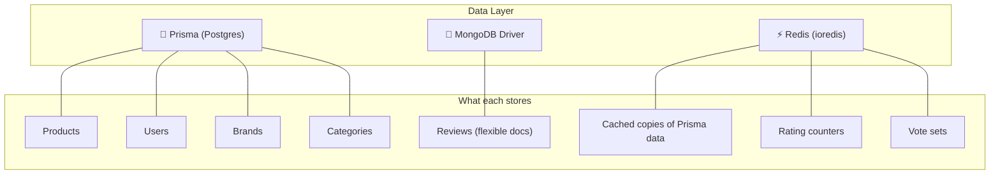
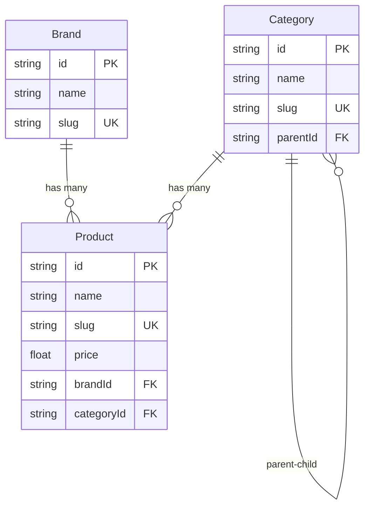
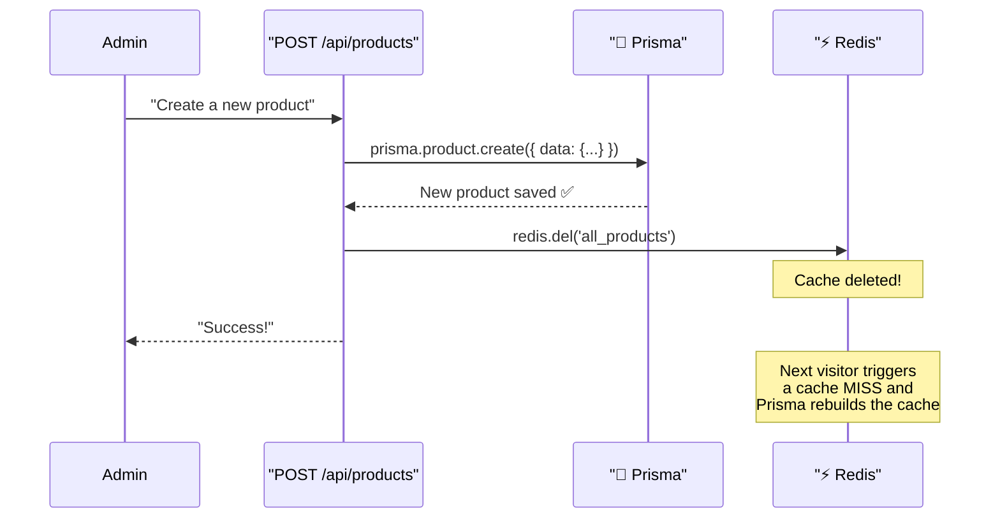

# 🐘 How Prisma Works in This Project (and Its Relationship with Redis)

---

## What is Prisma?

Prisma is an **ORM (Object-Relational Mapper)** — it lets you talk to your Postgres database using TypeScript instead of raw SQL.

```
Without Prisma (raw SQL):
  SELECT * FROM "Product" WHERE id = 'abc123';

With Prisma (TypeScript):
  await prisma.product.findUnique({ where: { id: 'abc123' } });
```

Both do the same thing. Prisma just gives you **type safety**, **autocompletion**, and **readable code**.

---

## The 3-Layer Architecture

In this project, Prisma is one of three data layers:



> [!IMPORTANT]
> **Prisma is the source of truth** for structured data. Redis is just a fast *copy*. If Redis crashes, we lose nothing — the data is rebuilt from Prisma/Postgres on the next request.

---

## Part 1: The Schema — Defining Your Database

**File:** [schema.prisma](file:///e:/Redis/product-review/prisma/schema.prisma)

This file is the **blueprint** of your entire Postgres database. Prisma reads it and:
1. Creates the actual database tables (via `npx prisma db push` or `migrate`)
2. Generates TypeScript types so your code has autocompletion

### Models = Tables

```prisma
model Product {
  id           String   @id @default(cuid())   // Primary key, auto-generated
  name         String                           // Required text
  slug         String   @unique                 // Unique URL-friendly name
  description  String?                          // Optional (the ? makes it nullable)
  price        Float?                           // Optional decimal number
  imageUrl     String?                          // Optional
  
  brandId      String                           // Foreign key
  brand        Brand    @relation(fields: [brandId], references: [id])
  
  categoryId   String                           // Foreign key
  category     Category @relation(fields: [categoryId], references: [id])

  createdAt    DateTime @default(now())         // Auto-set on creation
  updatedAt    DateTime @updatedAt              // Auto-updated on every change

  @@index([brandId])                            // Database index for faster queries
  @@index([categoryId])
}
```

**What each annotation means:**

| Annotation | Meaning |
|---|---|
| `@id` | This field is the primary key |
| `@default(cuid())` | Auto-generate a unique string ID |
| `@unique` | No two rows can have the same value |
| `String?` | Nullable (optional) |
| `@relation(fields: [brandId], references: [id])` | Foreign key → links to the `Brand` table |
| `@default(now())` | Auto-set to current timestamp |
| `@updatedAt` | Auto-update timestamp on every save |
| `@@index([brandId])` | Create a DB index for faster lookups |

### Relations



- A **Brand** has many **Products** (one-to-many)
- A **Category** has many **Products** (one-to-many)
- A **Category** can have child **Categories** (self-referencing relation)

---

## Part 2: The Connection

**File:** [prisma.ts](file:///e:/Redis/product-review/lib/prisma.ts)

```typescript
import { Pool } from 'pg'
import { PrismaPg } from '@prisma/adapter-pg'
import { PrismaClient } from '@prisma/client'

const globalForPrisma = globalThis as unknown as {
  prisma: PrismaClient | undefined
}

function createPrismaClient() {
  const connectionString = `${process.env.DATABASE_URL}`
  const pool = new Pool({ connectionString })        // Raw pg connection pool
  const adapter = new PrismaPg(pool)                  // Prisma adapter for pg
  
  return new PrismaClient({
    adapter,
    log: process.env.NODE_ENV === 'development' 
      ? ['query', 'error', 'warn']                    // Log SQL in dev
      : ['error'],
  })
}

export const prisma = globalForPrisma.prisma ?? createPrismaClient()

if (process.env.NODE_ENV !== 'production') globalForPrisma.prisma = prisma
```

**Line by line:**

| Line | What it does |
|---|---|
| `Pool` from `pg` | Creates a connection pool to Neon Postgres |
| `PrismaPg` adapter | Bridges Prisma to the `pg` pool (required for Neon/serverless) |
| `globalForPrisma` | Stores the client on `globalThis` to survive Next.js hot reloads |
| `log: ['query']` | In dev mode, every SQL query is printed to your terminal |
| `??` (nullish coalescing) | Reuse existing client if available, otherwise create a new one |

> [!NOTE]
> **Why the `pg` adapter?** Neon Postgres is serverless, so Prisma can't use its default connection method. The `@prisma/adapter-pg` package lets Prisma work with any standard `pg` pool, including Neon's.

---

## Part 3: Prisma CRUD Operations Used in This Project

Every Prisma operation follows the pattern: `prisma.{model}.{operation}()`

### CREATE — Adding data

**File:** [products/route.ts](file:///e:/Redis/product-review/app/api/products/route.ts) (line 32-41)

```typescript
const newProduct = await prisma.product.create({
  data: {
    name: "Sony WH-1000XM5",
    slug: "sony-wh-1000xm5",
    description: "Noise canceling headphones",
    price: 398.00,
    imageUrl: "https://...",
    brandId: "clx...",       // FK to Brand table
    categoryId: "clx...",    // FK to Category table
  }
});
// newProduct = { id: "clx...", name: "Sony WH-1000XM5", ... }
```

### READ — Fetching data

**Single record:**
```typescript
// Find by primary key
const product = await prisma.product.findUnique({
  where: { id: "abc123" }
});

// Find by any unique field
const product = await prisma.product.findUnique({
  where: { slug: "sony-wh-1000xm5" }
});
```

**Multiple records:**
```typescript
// All products, newest first
const products = await prisma.product.findMany({
  orderBy: { createdAt: 'desc' }
});

// With filtering
const products = await prisma.product.findMany({
  where: { brandId: "clx..." },     // Only this brand
  take: 10,                          // Limit to 10
  orderBy: { price: 'asc' }          // Cheapest first
});
```

**With relations (JOIN):**
```typescript
// Used in: app/admin/products/page.tsx
const products = await prisma.product.findMany({
  include: { 
    category: true,    // JOIN categories table
    brand: true        // JOIN brands table
  },
  orderBy: { createdAt: 'desc' }
});

// Result: products[0].brand.name → "Sony"
// Result: products[0].category.name → "Headphones"
```

**Select specific fields:**
```typescript
// Used in: app/api/search/route.ts
const products = await prisma.product.findMany({
  select: {
    id: true,
    name: true,
    price: true,
    brand: { select: { name: true } }   // Only brand name, not the full record
  },
  take: 5
});
```

### UPDATE — Modifying data

**File:** [manage/route.ts](file:///e:/Redis/product-review/app/api/products/%5Bid%5D/manage/route.ts) (PUT handler)

```typescript
const updated = await prisma.product.update({
  where: { id: "abc123" },
  data: { 
    name: "Updated Name",
    price: 299.99 
  },
});
```

### DELETE — Removing data

**File:** [manage/route.ts](file:///e:/Redis/product-review/app/api/products/%5Bid%5D/manage/route.ts) (DELETE handler)

```typescript
await prisma.product.delete({ 
  where: { id: "abc123" } 
});
```

### Searching (text contains)

**File:** [search/route.ts](file:///e:/Redis/product-review/app/api/search/route.ts)

```typescript
const products = await prisma.product.findMany({
  where: {
    OR: [
      { name: { contains: "headphones", mode: 'insensitive' } },
      { description: { contains: "headphones", mode: 'insensitive' } }
    ]
  },
  take: 5
});
```

---

## Part 4: How Prisma and Redis Work Together

This is the most important part. They play two distinct roles:

```
┌──────────────────────────────────┐
│         Prisma (Postgres)        │
│                                  │
│  • Source of truth               │
│  • Stores ALL structured data    │
│  • Handles writes (create,       │
│    update, delete)               │
│  • Speed: ~50-200ms per query    │
└───────────────┬──────────────────┘
                │
                │  Cache-Aside Pattern
                │
┌───────────────▼──────────────────┐
│           Redis                  │
│                                  │
│  • Fast read-only copy           │
│  • Stores JSON snapshots         │
│  • Handles reads (when cached)   │
│  • Speed: ~1-5ms per read        │
└──────────────────────────────────┘
```

### The Flow in Code

Here's every step that happens when a user visits the home page:

**File:** [page.tsx](file:///e:/Redis/product-review/app/page.tsx)

```typescript
// 1. Ask Redis: "Do you have the product list?"
const cachedData = await redis.get('all_products');

if (cachedData) {
  // 2a. YES → Skip Prisma entirely! Return cached data (1-5ms)
  products = JSON.parse(cachedData);
} else {
  // 2b. NO → Ask Prisma to query Postgres (50-200ms)
  products = await prisma.product.findMany({ orderBy: { createdAt: 'desc' } });
  
  // 3. Save the Prisma result into Redis for the next visitor
  await redis.setex('all_products', 1800, JSON.stringify(products));
}
```

### When Data Changes — The Invalidation Dance



**Every write through Prisma must be followed by a Redis invalidation:**

| Prisma Operation | Redis Invalidation | File |
|---|---|---|
| `prisma.product.create(...)` | `redis.del('all_products')` | [products/route.ts](file:///e:/Redis/product-review/app/api/products/route.ts#L44-L45) |
| `prisma.product.update(...)` | `redis.del('product_profile:' + id)` + `redis.del('all_products')` | [manage/route.ts](file:///e:/Redis/product-review/app/api/products/%5Bid%5D/manage/route.ts#L78-L80) |
| `prisma.product.delete(...)` | `redis.del('product_profile:' + id)` + `redis.del('all_products')` | [manage/route.ts](file:///e:/Redis/product-review/app/api/products/%5Bid%5D/manage/route.ts#L120-L123) |

### The Golden Rule

```
         WRITE path                          READ path
    ┌─────────────────┐              ┌─────────────────────┐
    │                 │              │                     │
    │  Always use     │              │  Try Redis first    │
    │  PRISMA to      │──── then ───▶│  Fall back to       │
    │  write data     │  invalidate  │  PRISMA if needed   │
    │                 │   Redis      │                     │
    └─────────────────┘              └─────────────────────┘
```

> [!WARNING]
> **Never write to Redis directly as a primary store.** Redis is volatile (in-memory). If the server restarts, all Redis data is lost. Always write to Prisma/Postgres first, then let Redis be a fast read cache.

---

## Part 5: Prisma CLI Commands Cheat Sheet

Run these from your project root:

| Command | What it does |
|---|---|
| `npx prisma db push` | Pushes your schema changes to the database (creates/modifies tables) |
| `npx prisma generate` | Regenerates the TypeScript types from your schema |
| `npx prisma studio` | Opens a visual database browser at `localhost:5555` |
| `npx prisma db seed` | Runs your seed script to populate test data |
| `npx prisma migrate dev` | Creates a migration file and applies it (for production workflows) |
| `npx prisma format` | Auto-formats your `schema.prisma` file |

---

## Part 6: Common Patterns Cheat Sheet

```typescript
// ── FIND ─────────────────────────────────────────
prisma.product.findUnique({ where: { id } })         // By primary key
prisma.product.findUnique({ where: { slug } })        // By unique field
prisma.product.findMany()                              // All records
prisma.product.findMany({ take: 10 })                  // Limit
prisma.product.findMany({ skip: 10, take: 10 })       // Pagination
prisma.product.findMany({ orderBy: { price: 'asc' }}) // Sorting
prisma.product.findMany({ where: { price: { gt: 100 }}}) // Filtering

// ── CREATE ───────────────────────────────────────
prisma.product.create({ data: { name, slug, ... } })

// ── UPDATE ───────────────────────────────────────
prisma.product.update({ where: { id }, data: { name: "New" } })

// ── DELETE ───────────────────────────────────────
prisma.product.delete({ where: { id } })
prisma.product.deleteMany({ where: { brandId: "..." } }) // Batch delete

// ── COUNT ────────────────────────────────────────
prisma.product.count()
prisma.product.count({ where: { brandId: "..." } })

// ── RELATIONS (JOIN) ─────────────────────────────
prisma.product.findMany({
  include: { brand: true, category: true }             // Include related records
})
prisma.product.findMany({
  select: { name: true, brand: { select: { name: true } } } // Pick specific fields
})

// ── FILTERS ──────────────────────────────────────
{ price: { gt: 100 } }             // Greater than
{ price: { gte: 100 } }            // Greater than or equal
{ price: { lt: 500 } }             // Less than
{ name: { contains: "Sony" } }     // LIKE '%Sony%'
{ name: { startsWith: "Air" } }    // LIKE 'Air%'
{ id: { in: ["a", "b", "c"] } }    // WHERE id IN (...)
{ OR: [{ ... }, { ... }] }         // OR conditions
{ AND: [{ ... }, { ... }] }        // AND conditions
```
