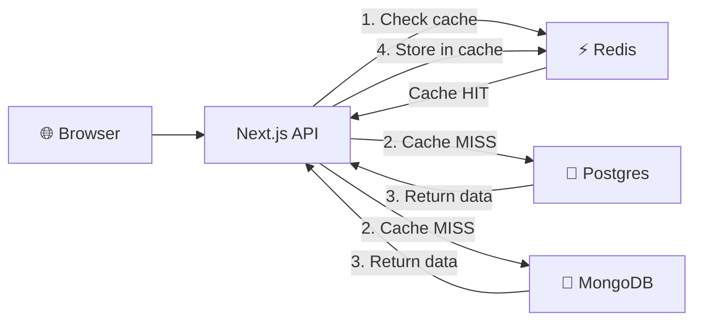
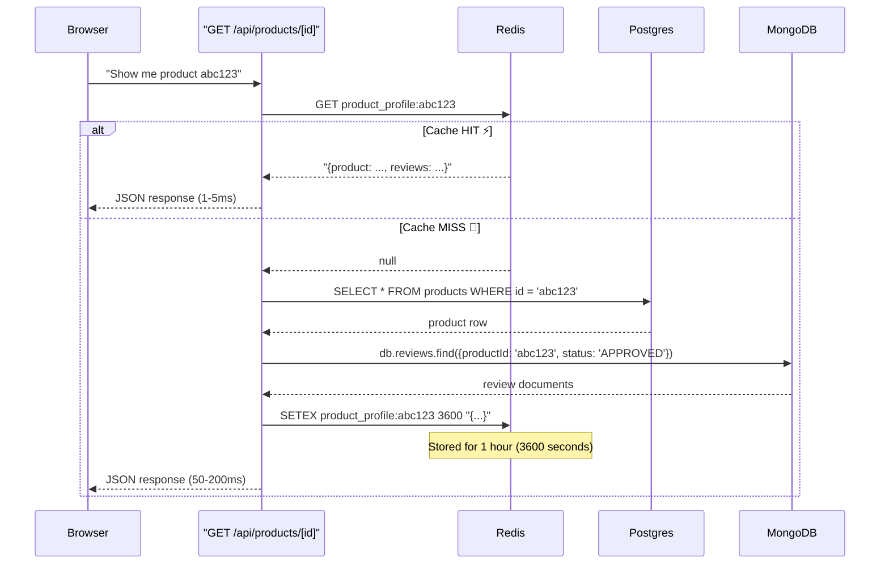
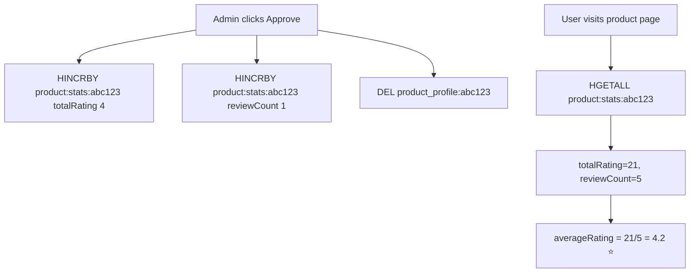
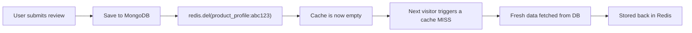

# 🚀 How Redis Caching Works in This Project

This guide explains every Redis pattern we use, from the simplest to the most advanced. By the end, you'll understand *why* we use Redis, *how* each data structure works, and *where* to find the code.

---

## The Big Picture: Why Redis?

Our app has **3 databases**, each serving a different purpose:

| Database | What it stores | Speed |
|---|---|---|
| **Postgres** (Prisma) | Products, categories, brands, users | ~50-200ms |
| **MongoDB** | Reviews (flexible schema) | ~30-100ms |
| **Redis** | Cached copies + live counters | **~1-5ms** |

> [!IMPORTANT]
> Redis stores data **in memory** (RAM), not on disk. That's why it's 10-100x faster than Postgres or MongoDB. The tradeoff is that data can be lost on restart — but that's fine because we only store *copies* and *counters* that can be rebuilt.

Here's the architecture at a glance:



---

## 0. The Redis Connection

**File:** [redis.ts](file:///e:/Redis/product-review/lib/redis.ts)

```typescript
import Redis from 'ioredis';

const redisUrl = process.env.REDIS_URL || 'redis://localhost:6379';

// Prevent creating multiple connections during Next.js hot reloads
const globalForRedis = global as unknown as { redis: Redis };
export const redis = globalForRedis.redis || new Redis(redisUrl);
if (process.env.NODE_ENV !== 'production') globalForRedis.redis = redis;
```

**What this does:**
- Connects to your local Redis server on port `6379`
- Stores the connection on `global` so Next.js dev-mode hot reloading doesn't create a new connection every time a file changes
- Exports a single `redis` object that every API route imports

---

## Pattern 1: Cache-Aside with Strings (`GET` / `SET` / `SETEX`)

This is the **core caching pattern** of the entire project. We use it in two places:

### 1A. Product Profile Caching

**File:** [route.ts](file:///e:/Redis/product-review/app/api/products/%5Bid%5D/route.ts)

**Redis key format:** `product_profile:{productId}`

**Redis data type:** String (stores a JSON blob)

Here's the flow, step by step:



**The key code:**

```typescript
// Step 1: Try Redis first
const cacheKey = `product_profile:${id}`;
const cachedData = await redis.get(cacheKey);

if (cachedData) {
  // ⚡ CACHE HIT! Return the cached JSON instantly
  const profile = JSON.parse(cachedData);
  profile.metadata.source = 'REDIS_CACHE';
  profile.metadata.responseTimeMs = Date.now() - startTime; // usually 1-5ms
  return NextResponse.json(profile);
}

// 🐢 CACHE MISS! Query both databases...
const product = await prisma.product.findUnique({ where: { id } });      // Postgres
const reviews = await mongoDb.collection('reviews').find({...}).toArray(); // MongoDB

// Assemble the response
const profile = { product, reviews, averageRating, reviewCount, metadata };

// Step 2: Save to Redis so the NEXT visitor gets it instantly
await redis.setex(cacheKey, 3600, JSON.stringify(profile));
//                          ^^^^
//                   expires in 1 hour
```

> [!TIP]
> **`SETEX` = `SET` + `EXPIRE` in one command.** `redis.setex(key, 3600, value)` means "store this value and automatically delete it after 3600 seconds." This prevents stale data from living forever.

**What the user sees:**

The `<CacheBanner />` component ([cache-banner.tsx](file:///e:/Redis/product-review/components/cache-banner.tsx)) visually shows whether the data came from Redis or the databases:

- First visit: 🐢 **"DATABASE_AGGREGATION — 150ms"** (red banner)
- Second visit: ⚡ **"REDIS_CACHE — 2ms"** (green banner)

---

### 1B. Search Results Caching

**File:** [route.ts](file:///e:/Redis/product-review/app/api/search/route.ts)

**Redis key format:** `search:{md5Hash}`

**Same pattern**, but for search queries:

```typescript
// Hash the search query to create a clean Redis key
const normalizedQuery = query.trim().toLowerCase();
const queryHash = crypto.createHash('md5').update(normalizedQuery).digest('hex');
const cacheKey = `search:${queryHash}`;
// e.g. searching "headphones" → key = "search:a8f5f167f44f..."

// Same Cache-Aside pattern
const cachedData = await redis.get(cacheKey);

if (cachedData) {
  return NextResponse.json({ results: JSON.parse(cachedData), ... });
}

// Cache miss → query Postgres
const products = await prisma.product.findMany({
  where: {
    OR: [
      { name: { contains: query, mode: 'insensitive' } },
      { description: { contains: query, mode: 'insensitive' } }
    ]
  },
  take: 5
});

// Save for 1 hour
await redis.setex(cacheKey, 3600, JSON.stringify(products));
```

> [!NOTE]
> **Why hash the query?** Redis keys should be short and predictable. A search for "premium wireless headphones" would make an ugly key. By hashing it, every query becomes a clean 32-character hex string. Also, `"Headphones"` and `"headphones"` hash to the same key thanks to `.toLowerCase()`.

---

## Pattern 2: Hashes (`HINCRBY` / `HGETALL`)

**Used for:** Atomic rating aggregation

**Files:**
- Write: [admin/reviews/route.ts](file:///e:/Redis/product-review/app/api/admin/reviews/route.ts) (line 42-43)
- Read: [products/[id]/route.ts](file:///e:/Redis/product-review/app/api/products/%5Bid%5D/route.ts) (line 56-60)

**Redis key format:** `product:stats:{productId}`

### The Problem

When an admin approves a review, we need to update the product's average rating. Without Redis, we'd have to:

1. Query MongoDB for ALL approved reviews for that product
2. Sum all ratings
3. Divide by count

That's a full table scan every time someone views a product page!

### The Redis Solution

Instead, we store two counters in a Redis Hash:

```
product:stats:abc123
├── totalRating: 21    (sum of all approved ratings)
└── reviewCount: 5     (number of approved reviews)
```

**When an admin approves a review:**

```typescript
// In POST /api/admin/reviews
if (action === 'APPROVE') {
  const statsKey = `product:stats:${review.productId}`;
  
  // HINCRBY atomically increments a hash field
  await redis.hincrby(statsKey, 'totalRating', review.rating); // e.g. +4
  await redis.hincrby(statsKey, 'reviewCount', 1);             // +1

  // Also invalidate the cached profile so new data shows up
  await redis.del(`product_profile:${review.productId}`);
}
```

**When someone views a product:**

```typescript
// In GET /api/products/[id]
const statsKey = `product:stats:${id}`;
const rawStats = await redis.hgetall(statsKey);
// rawStats = { totalRating: "21", reviewCount: "5" }

const totalRating = parseInt(rawStats.totalRating || '0', 10);
const reviewCount = parseInt(rawStats.reviewCount || '0', 10);
const averageRating = reviewCount > 0 
  ? (totalRating / reviewCount).toFixed(1)  // "4.2"
  : '0.0';
```

> [!IMPORTANT]
> **Why not just store the average directly?** Because `HINCRBY` is **atomic** — even if 100 admins approve reviews at the same exact millisecond, Redis will never lose a count. If we stored the average, we'd have race conditions. Storing `totalRating` and `reviewCount` separately and dividing on read is the safe pattern.



---

## Pattern 3: Sets (`SADD` / `SISMEMBER` / `SREM`)

**Used for:** Vote deduplication (preventing one user from voting twice)

**File:** [vote/route.ts](file:///e:/Redis/product-review/app/api/reviews/vote/route.ts)

**Redis key format:** `review:{reviewId}:upvotes` and `review:{reviewId}:downvotes`

### The Problem

When a user clicks 👍 on a review, we need to:
1. Check if they already voted (to prevent spam)
2. If they switch from 👎 to 👍, remove the old vote first
3. Record the new vote

Doing this with database queries alone is slow and complex.

### The Redis Solution

A **Set** is a collection of unique values. Think of it as a guest list at a party — you're either on it or you're not, and you can't be added twice.

```
review:abc123:upvotes
├── "session-uuid-001"    ← User A upvoted
├── "session-uuid-002"    ← User B upvoted
└── "session-uuid-003"    ← User C upvoted

review:abc123:downvotes
└── "session-uuid-004"    ← User D downvoted
```

**The code flow:**

```typescript
const upKey = `review:${reviewId}:upvotes`;
const downKey = `review:${reviewId}:downvotes`;

// SISMEMBER → "Is this sessionId in the set?" Returns 1 (yes) or 0 (no)
const hasUpvoted = await redis.sismember(upKey, sessionId);
const hasDownvoted = await redis.sismember(downKey, sessionId);

if (direction === 'up') {
  if (hasUpvoted) {
    // Already upvoted → toggle OFF (undo)
    await redis.srem(upKey, sessionId);      // Remove from set
    await mongoDb.collection('reviews').updateOne(..., { $inc: { upvotes: -1 } });
  } else {
    // New upvote
    if (hasDownvoted) {
      // Was a downvote → switch: remove old first
      await redis.srem(downKey, sessionId);
      await mongoDb.collection('reviews').updateOne(..., { $inc: { downvotes: -1 } });
    }
    await redis.sadd(upKey, sessionId);      // Add to set
    await mongoDb.collection('reviews').updateOne(..., { $inc: { upvotes: 1 } });
  }
}
```

> [!TIP]
> **`SISMEMBER` is O(1)** — it takes the same amount of time whether there are 10 or 10 million members in the set. That's what makes Redis perfect for this kind of check.

---

## Pattern 4: Cache Invalidation (`DEL`)

This is not a data structure — it's a **strategy**. The hardest part of caching is knowing *when to delete stale data*. In our project, we invalidate the cache in **4 places**:

| Event | What we delete | File |
|---|---|---|
| New review submitted | `product_profile:{id}` | [reviews/route.ts](file:///e:/Redis/product-review/app/api/reviews/route.ts#L33-L34) |
| Admin approves review | `product_profile:{id}` | [admin/reviews/route.ts](file:///e:/Redis/product-review/app/api/admin/reviews/route.ts#L46) |
| Admin updates product | `product_profile:{id}` | [manage/route.ts](file:///e:/Redis/product-review/app/api/products/%5Bid%5D/manage/route.ts#L80) |
| Admin deletes product | `product_profile:{id}` + `product:stats:{id}` | [manage/route.ts](file:///e:/Redis/product-review/app/api/products/%5Bid%5D/manage/route.ts#L117-L118) |

The code is always the same:

```typescript
await redis.del(`product_profile:${productId}`);
```

This is the "**Cache-Aside with manual invalidation**" strategy:
- On **READ** → check cache first, fill it on miss
- On **WRITE** → delete the cache key so the next read rebuilds it



> [!WARNING]
> **Never update the cache directly on write.** Always delete and let the next read rebuild it. Why? Because if two users submit reviews at the same millisecond, directly updating the cache could cause one write to overwrite the other. Deleting is safe because the worst case is two cache misses, which just means two database reads — no data loss.

---

## Summary: All Redis Keys in the Project

| Key Pattern | Data Type | TTL | Purpose |
|---|---|---|---|
| `product_profile:{id}` | String (JSON) | 1 hour | Full product + reviews cache |
| `search:{md5hash}` | String (JSON) | 1 hour | Search results cache |
| `product:stats:{id}` | Hash | ∞ (permanent) | Rating counters (`totalRating`, `reviewCount`) |
| `review:{id}:upvotes` | Set | ∞ (permanent) | Session IDs who upvoted |
| `review:{id}:downvotes` | Set | ∞ (permanent) | Session IDs who downvoted |

---

## Redis Commands Cheat Sheet

| Command | What it does | Example |
|---|---|---|
| `GET key` | Read a string value | `redis.get("product_profile:abc")` |
| `SETEX key ttl value` | Write with auto-expiry | `redis.setex("search:...", 3600, json)` |
| `DEL key` | Delete a key | `redis.del("product_profile:abc")` |
| `HINCRBY key field amount` | Increment a hash field | `redis.hincrby("product:stats:abc", "reviewCount", 1)` |
| `HGETALL key` | Read all fields in a hash | `redis.hgetall("product:stats:abc")` |
| `SADD key member` | Add to a set | `redis.sadd("review:abc:upvotes", "session-123")` |
| `SREM key member` | Remove from a set | `redis.srem("review:abc:upvotes", "session-123")` |
| `SISMEMBER key member` | Check if member exists | `redis.sismember("review:abc:upvotes", "session-123")` |
