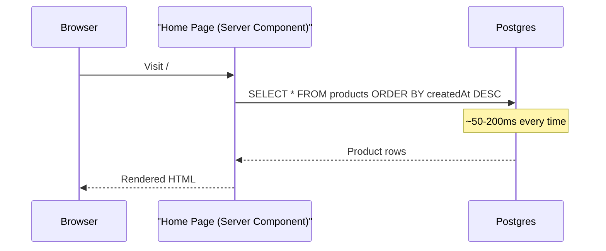
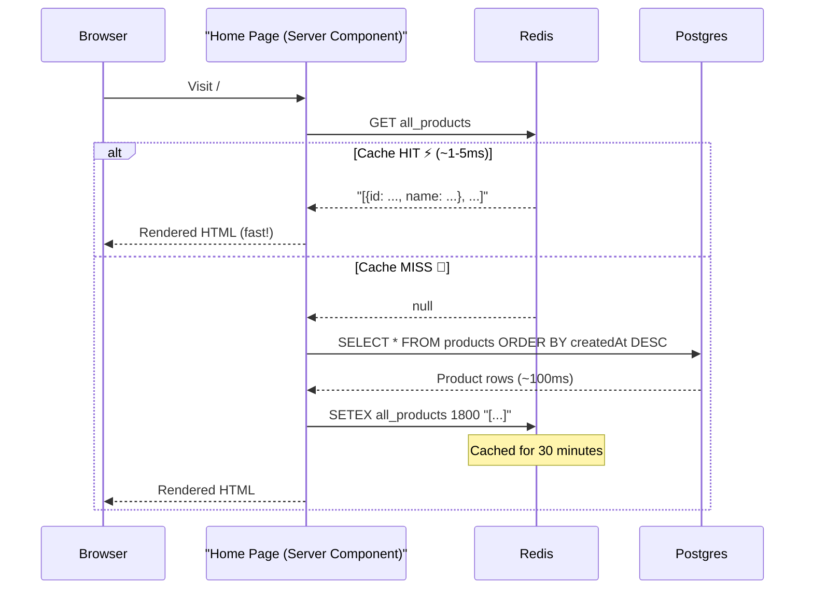

# Adding Redis Cache to the Home Page — Step by Step

This guide walks you through adding Redis caching to the home page product listing. We'll follow the exact same **Cache-Aside** pattern you already have for individual product profiles.

---

## Before: What Happens Now (No Cache)



Every single visitor triggers a Postgres query. If 1000 people visit the home page per minute, that's 1000 database queries per minute — even though the product list rarely changes.

---

## After: With Redis Cache



---

## Step 1: Cache the READ (Home Page)

**File:** `app/page.tsx`

### Before (line 7-9):
```typescript
const products = await prisma.product.findMany({
  orderBy: { createdAt: 'desc' }
});
```

### After:
```typescript
import { redis } from '@/lib/redis';    // ← ADD this import

// ...inside the component:

const CACHE_KEY = 'all_products';        // ← The Redis key name

// Step 1: Try Redis first
const cachedData = await redis.get(CACHE_KEY);

let products;

if (cachedData) {
  // ⚡ CACHE HIT! Parse the JSON string back into an array
  products = JSON.parse(cachedData);
} else {
  // 🐢 CACHE MISS! Query Postgres
  products = await prisma.product.findMany({
    orderBy: { createdAt: 'desc' }
  });

  // Step 2: Store in Redis for the NEXT visitor
  // SETEX = SET + EXPIRE → auto-deletes after 1800 seconds (30 minutes)
  await redis.setex(CACHE_KEY, 1800, JSON.stringify(products));
}
```

**What each line does:**

| Line | Purpose |
|---|---|
| `redis.get(CACHE_KEY)` | Ask Redis: "Do you have `all_products`?" |
| `JSON.parse(cachedData)` | Redis stores strings, so we parse the JSON back to an array |
| `prisma.product.findMany(...)` | Only runs if Redis returned `null` (cache miss) |
| `redis.setex(CACHE_KEY, 1800, ...)` | Store the result for 30 min so the next visitor gets it instantly |
| `JSON.stringify(products)` | Convert the array to a JSON string because Redis only stores strings |

> [!NOTE]
> **Why 1800 seconds (30 minutes)?** The home page product list doesn't change very often — only when an admin adds, edits, or deletes a product. A 30-minute TTL is a good balance between freshness and performance. Even if you don't invalidate manually, the data will auto-refresh every 30 minutes.

---

## Step 2: Invalidate on WRITE

Caching the read is only half the puzzle. We also need to **delete the cache** whenever the product list changes. Otherwise, the home page would show stale data until the TTL expires.

There are **3 places** where the product list can change:

### 2A. When an admin CREATES a product

**File:** `app/api/products/route.ts`

```diff
+import { redis } from '@/lib/redis';

 // After saving the new product to Postgres:
 const newProduct = await prisma.product.create({ data: { ... } });

+// Invalidate the home page cache
+await redis.del('all_products');

 return NextResponse.json({ success: true, product: newProduct });
```

### 2B. When an admin UPDATES a product

**File:** `app/api/products/[id]/manage/route.ts` (PUT handler)

```diff
 const updated = await prisma.product.update({ where: { id }, data: { ... } });

 await redis.del(`product_profile:${id}`);   // existing line
+await redis.del('all_products');              // ← ADD this
```

### 2C. When an admin DELETES a product

**File:** `app/api/products/[id]/manage/route.ts` (DELETE handler)

```diff
 await prisma.product.delete({ where: { id } });

 await redis.del(`product_profile:${id}`);   // existing line
 await redis.del(`product:stats:${id}`);     // existing line
+await redis.del('all_products');              // ← ADD this
```

> [!IMPORTANT]
> **The rule is simple:** Any time you run `prisma.product.create()`, `.update()`, or `.delete()`, you must also run `redis.del('all_products')`. This ensures the next home page visitor gets a fresh list.

---

## Step 3: See It Work

After making the changes:

1. **Visit the home page** — You'll see `CACHE MISS` in your terminal logs (if you add logging)
2. **Refresh the page** — Now it's a `CACHE HIT`, served from Redis in ~1-5ms
3. **Go to Admin → Add a new product** — This triggers `redis.del('all_products')`
4. **Go back to the home page** — Another `CACHE MISS`, but now the new product is visible
5. **Refresh again** — `CACHE HIT` with the updated list

---

## The Complete Mental Model

```
┌─────────────────────────────────────────────────┐
│                   READS                          │
│                                                  │
│  Home Page  →  redis.get('all_products')         │
│                    │                             │
│              HIT?  ├── YES → return cached data  │
│                    │                             │
│                    └── NO  → query Postgres      │
│                              │                   │
│                              └→ redis.setex()    │
│                                 (save for next)  │
└─────────────────────────────────────────────────┘

┌─────────────────────────────────────────────────┐
│                  WRITES                          │
│                                                  │
│  POST /api/products       → redis.del()          │
│  PUT  /api/products/[id]  → redis.del()          │
│  DELETE /api/products/[id] → redis.del()         │
│                                                  │
│  All three delete the 'all_products' key,        │
│  forcing the next READ to rebuild from Postgres. │
└─────────────────────────────────────────────────┘
```
